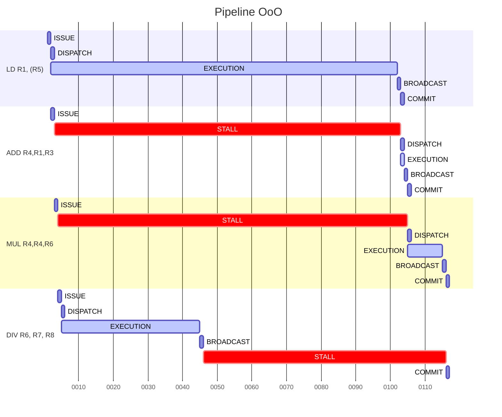
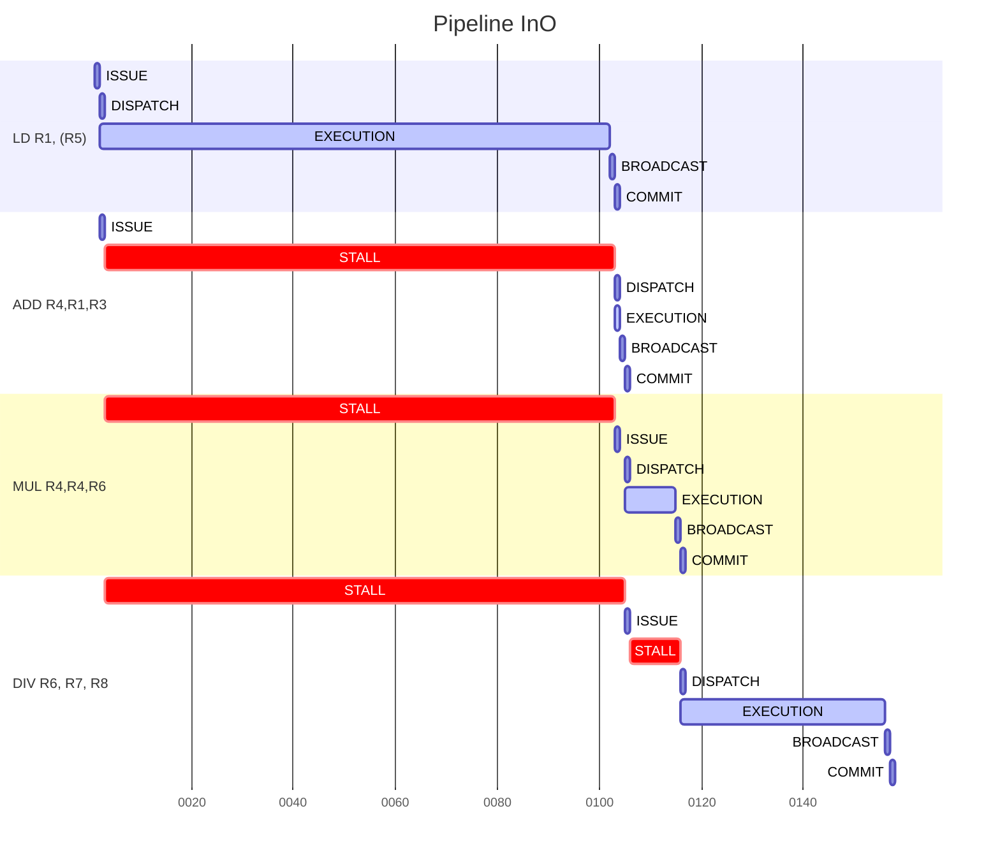

We see in this pipeline that :
- ISSUE and COMMIT are made in program order.
- DISPATCH and BROADCAST are made out-of-order.
- When we wait for load completion, we can execute other instruction thanks to the out-of-order execution.
- Despite this, if there is data dependencies, we have to wait as in a in order core.

With an In order execution we have 30 cycles of execution more.

___
## Full example

- Issue 1 instruction per cycle
- ADD : 1 cycle
- MUL : 10 cycles
- DIV : 40 cycles
- LD : 100 cycles

### Cycle 0 

![[Issue 0|600]]
___
### Cycle 1

##### ISSUE

**1)** First instruction is a LOAD, so the LSU reservation station will be used. 
	As there is free slots in LSU reservation station, the instruction can be issued to it.
	- The physical destination register is the ROB slot.
	- Physical source register 1 = Architectural source register 1, as R5 slot in the RAT is empty. There is no renaming, we take the value in the register file.

**2)** The ROB slot indicated by the issue pointer is reserved, and filled with the correct data.
	The issue pointer is incremented

**3)** The RAT is updated, to link the destination register R1 with ROB 1, where the operation result will be stored.

![[Issue 1|600]]

##### DISPATCH

The first instruction is in its reservation station, as its operand is available in register file, and LSU is free, we can dispatch it in the next cycle.

![[Dispatch 0|600]]
___
### Cycle 2

##### ISSUE

**1)** Next instruction is an ADD, so the ADD reservation station will be used. 
	As there is free slots in ADD reservation station, the instruction can be issued to it.
	- The physical destination register is the ROB slot.
	- Physical source register 2 = Architectural source register 2, as R3 slot in the RAT is empty. There is no renaming, we take the value in the register file.
	- Physical source register 1 != Architectural source register 1, because R1 is renamed to ROB1, to take into account the result of the previous instruction.

>**NB :** We have here a Read-After-Write dependency with the previous instruction. 
>The reservation station will wait until ROB 1 value is available to dispatch the instruction.

**2)** The ROB slot indicated by the issue pointer is reserved, and filled with the correct data.
	The issue pointer is incremented.

**3)** The RAT is updated, to link the destination register R4 with ROB 2, where the operation result will be stored.

![[Issue 2|600]]

##### DISPATCH

**1)** Next instruction is issued in its reservation station as explained in ISSUE.

**2)** Previous instruction is dispatched in the LSU unit, it will take 100 cycles to complete the load.
	At the same time, the LSU reservation station slot becomes free.

**3)** The second instruction is in its reservation station, as its operands are not all available in register file or ROB, we cannot dispatch it in the next cycle.

![[Dispatch 1|600]]
___
### Cycle 3

##### ISSUE

**1)** Next instruction is a MUL, so the MUL reservation station will be used. 
	As there is free slots in MUL reservation station, the instruction can be issued to it.
	- The physical destination register is the ROB slot.
	- Physical source register 2 = Architectural source register 2, as R6 slot in the RAT is empty. There is no renaming, we take the value in the register file.
	- Physical source register 1 != Architectural source register 1, because R4 is renamed to ROB 2, to take into account the result of the previous instruction.

>**NB :** We have here a Read-After-Write dependency with the previous instruction. 
>The reservation station will wait until ROB 2 value is available to dispatch the instruction.

**2)** The ROB slot indicated by the issue pointer is reserved, and filled with the correct data.
	The issue pointer is incremented.

**3)** The RAT is updated, to link the destination register R4 with ROB 3, where the operation result will be stored.

>**NB :** We have here a Write-After-Write dependency. The RAT update removes ROB 2 from RAT, but  it's not a problem. 
>All instructions that are not yet executed, and need the old value of R4 will find it in the ROB. That's why we write ROB id in reservation stations.
>So, this MUL instruction, will take for R4 value, the ROB 2 value.

**Thanks to registers renaming, we remove WAW dependencies between instructions.**

![[Issue 3|600]]

##### DISPATCH

**1)** Next instruction is issued in its reservation station as explained in ISSUE.

**2)** Previous instruction cannot be dispatched in the ADD unit, so it waits in its reservation station until ROB 1 value is available. This value will be available when LSU completes its load.

**3)** The third instruction is in its reservation station, as its operands are not all available in register file or ROB, we cannot dispatch it in the next cycle.

![[Dispatch 2|600]]
___
### Cycle 4

##### ISSUE

**1)** Next instruction is a DIV, so the MUL reservation station will be used. 
	As there is free slots in MUL reservation station, the instruction can be issued to it.
	- The physical destination register is the ROB slot.
	- Physical source register 2 = Architectural source register 2, as R7 slot in the RAT is empty. There is no renaming, we take the value in the register file.
	- Physical source register 2 = Architectural source register 2, as R8 slot in the RAT is empty. There is no renaming, we take the value in the register file.

**2)** The ROB slot indicated by the issue pointer is reserved, and filled with the correct data.
	The issue pointer is incremented.

**3)** The RAT is updated, to link the destination register R6 with ROB 4, where the operation result will be stored.

>**NB :** We have here a Write-After-Read dependency. As the DIV instruction, will not wait for data to execute. 
>So it could execute before the MUL instruction, and write the result in R6 before the MUL instruction read it. But as we write the result in ROB 4 and not in R6, there is no problem.

**Thus, thanks to registers renaming, we remove WAR dependencies between instructions.**

![[Issue 4|600]]

##### DISPATCH

**1)** Next instruction is issued in its reservation station as explained in ISSUE.

**2)** Previous instruction cannot be dispatched in the MUL unit, so it waits in its reservation station until ROB 2 value is available. This value will be available when ADD completes its execution.

**3)** The DIV instruction is in its reservation station, as its operands are available in register file, and the MUL unit is free, we can dispatch it in the next cycle.

![[Dispatch 3|600]]
___
### Cycle 5

##### DISPATCH

**1)** Previous instruction is dispatched in the MUL unit, it will take 40 cycles to complete the division.
	At the same time, the MUL reservation station slot becomes free.

>**NB :** That's here, that we see the **out-of-order** execution
>Because the DIV instruction executes even if there are instructions before it, that are not yet executed. Thus, instead of waiting for an instruction to complete, we can execute other instructions and increase performance.

**2)** Since the issue queue is empty, and the busy reservation stations are waiting for operands, there is nothing to dispatch until cycle 103. (Load begins in cycle 2 and completes after 100 cycles)
Before the cycle 103, the DIV instruction ends its execution, we see it in BROADCAST.

![[Dispatch 4|600]]
___
### Cycle 44 

##### BROADCAST

The DIV instruction is the first instruction that ends its execution, we can broadcast its result in the next cycle.

![[Broadcast 0|600]]
___
### Cycle 45 

##### BROADCAST

**1)** The division result is available, it is broadcast to the ROB to store it. As no reservation stations wait for this result, we don't need to broadcast it to them.

**2)** The MUL unit becomes free to execute another instruction.

The load instruction will be the next to complete in cycle 102.

![[Broadcast 1|600]]
___
### Cycle 46

As the DIV instruction was broadcast in the previous cycle, we should commit this instruction now. However, the commit pointer, in the ROB, is not yet at this instruction, because we have not committed the instructions before.

So, the next instruction to be committed, will be the load instruction in cycle 103.
___
### Cycle 102 

##### BROADCAST

**1)** The load result is available, it is broadcast to the ROB to store it. As the ADD reservation station wait for this result, we broadcast it to this reservation station.

**2)** The LSU unit becomes free to execute another instruction.

The ADD instruction will be the next to complete in cycle 104.

![[Broadcast 2|600]]
___
### Cycle 103

##### DISPATCH

**1)** In the previous cycle, the load instruction completes, so the ROB 1 has its value.

**2)** The ADD instruction has all its operands now available, and as the ADD unit is free, we can dispatch it. It will take 1 cycle to complete the addition.
At the same time, the ADD reservation station slot becomes free.

**3)** The last busy reservation station is waiting for operands, there is nothing to dispatch until cycle 105.

![[Dispatch 5|600]]

##### COMMIT

The load instruction was broadcast in the previous cycle, we can commit it now.

**1)** Update R1 in the register file with the ROB 1 value.
**2)** In the RAT, the R1 entry is still associated with ROB 1, so we update the RAT to link the R1 entry with the register file.
**3)** Clear the ROB 1 slot, and increment the commit pointer.

The next instruction to be committed, will be the ADD instruction in cycle 105.

![[Commit 1|600]]
___
#### Cycle 104 

##### BROADCAST

**1)** The addition result is available, it is broadcast to the ROB to store it. As the MUL reservation station wait for this result, we broadcast it to this reservation station.

**2)** The ADD unit becomes free to execute another instruction.

The MUL instruction will be the next to complete in cycle 115.

![[Broadcast 3.1|600]]
___
### Cycle 105

##### DISPATCH

**1)** In the previous cycle, the ADD instruction completes, so the ROB 2 has its value.

**2)** The MUL instruction has all its operands now available, and as the MUL unit is free, we can dispatch it. It will take 10 cycles to complete the multiplication.
At the same time, the MUL reservation station slot becomes free.

![[Dispatch 6.1|600]]

##### COMMIT

The ADD instruction was broadcast in the previous cycle, we can commit it now.

**1)** Update R4 in the register file with the ROB 2 value.
**2)** In the RAT, the R4 entry is not associated with ROB 2, so we must not update the RAT, because instructions after the ADD instruction could use the wrong value.
**3)** Clear the ROB 2 slot, and increment the commit pointer.

The next instruction to be committed, will be the MUL instruction in cycle 116.

![[Commit 2|600]]
___
### Cycle 115 

##### BROADCAST

**1)** The multiplication result is available, it is broadcast to the ROB to store it. As no reservation stations wait for this result, we don't need to broadcast it to them.

**2)** The MUL unit becomes free to execute another instruction.

![[Broadcast 4.1|600]]
___
### Cycle 116

##### COMMIT

The MUL instruction was broadcast in the previous cycle, we can commit it now.

**1)** Update R4 in the register file with the ROB 3 value.
**2)** In the RAT, the R4 entry is still associated with ROB 3, so we update the RAT to link the R4 entry with the register file.
**3)** Clear the ROB 3 slot, and increment the commit pointer.

The next instruction to be committed, will be the DIV instruction in the next cycle, because this instruction has already been executed and is only waiting for commit.

![[Commit 3|600]]
___
### Cycle 117

##### COMMIT

After waiting, the DIV instruction can be committed now.

**1)** Update R6 in the register file with the ROB 4 value.
**2)** In the RAT, the R6 entry is still associated with ROB 4, so we update the RAT to link the R6 entry with the register file.
**3)** Clear the ROB 4 slot, and increment the commit pointer. The issue pointer and the commit pointer are in the same level now. This is proof that we have finished processing all the instructions.

After 117 cycles, we finished the processing of the 4 instructions.

![[Commit 4|600]]